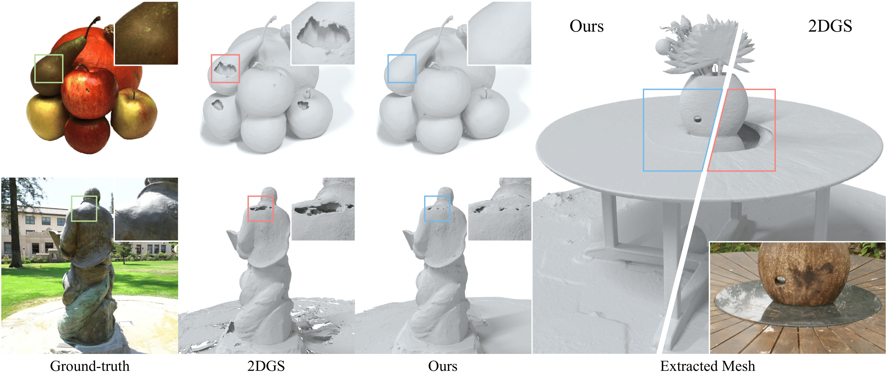

<p align="center">

  <h1 align="center">Introducing Unbiased Depth into 2D Gaussian Splatting for
  High-accuracy Surface Reconstruction</h1>
  <p align="center">
    <a>Xiaomin Peng</a>
    ·
    <a>Yixin Yang</a>
    ·
    <a href="https://zhouyangvcc.github.io/">Yang Zhou</a>
    ·
    <a href="https://vcc.tech/~huihuang">Hui Huang</a>
  </p>


  <h3 align="center"><a href="">Paper</a> | <a href="">arXiv</a> </h3>
  <div align="center"></div>
</p>


<p align="center">
  <a href="">
    
  </a>
</p>

<p align="center">
We introduce unbiased depth into 2DGS, effectively solving the holes in specular highlight regions and significantly improving the geometry quality of surface reconstruction.
</p>
<br>

# Installation
Clone the repository and create an anaconda environment using
```
git clone git@github.com:XiaoXinyyx/Unbiased_Surfel.git --recursive

# if you have an environment used for 2dgs/3dgs, use it
# if not, create a new environment
conda env create --file environment.yml
conda activate unbiased_surfel
```

# Training

To train a scene, simply use

```
python train.py -s <path to COLMAP or NeRF Synthetic dataset>
```

Commandline arguments for regularizations
```
--lambda_normal   # hyperparameter for normal consistency
--lambda_converge # hyperparameter for depth converge (Ours)
--lambda_dist     # hyperparameter for depth converge (2DGS)
```

# Testing
## Bounded Mesh Extraction
To export a mesh within a bounded volume, simply use
```
python render.py -m <path to pre-trained model> -s <path to COLMAP dataset> 
```
Commandline arguments you should adjust accordingly for meshing for bounded TSDF fusion, use
```
--voxel_size # voxel size
--depth_trunc # depth truncation
```
If these arguments are not specified, the script will automatically estimate them using the camera information.

## Unbounded Mesh Extraction
To export a mesh with an arbitrary size, we devised an unbounded TSDF fusion with space contraction and adaptive truncation.
```
python render.py -m <path to pre-trained model> -s <path to COLMAP dataset> --mesh_res 1024
```

# Full evaluation

We provide scripts to evaluate our method on [Mip-NeRF 360](https://jonbarron.info/mipnerf360/), [Tanks and Template](https://www.tanksandtemples.org/download/) and [DTU](https://drive.google.com/drive/folders/1SJFgt8qhQomHX55Q4xSvYE2C6-8tFll9) dataset.
```
# DTU dataset
python scripts/dtu_eval.py

# Mip-NeRF 360 dataset
python scripts/m360_eval.py

# Tanks and Template dataset
python scripts/tnt_eval.py
```

# Acknowledgements
This project is built upon [2DGS](https://github.com/hbb1/2d-gaussian-splatting) and [3DGS](https://github.com/graphdeco-inria/gaussian-splatting). The TSDF fusion for extracting mesh is based on [Open3D](https://github.com/isl-org/Open3D). The rendering script for MipNeRF360 is adopted from [Multinerf](https://github.com/google-research/multinerf/), while the evaluation scripts for DTU and Tanks and Temples dataset are built apon [DTUeval-python](https://github.com/jzhangbs/DTUeval-python) and [TanksAndTemples](https://github.com/isl-org/TanksAndTemples/tree/master/python_toolbox/evaluation), respectively. The fusing operation for accelerating the renderer is inspired by [Han's repodcue](https://github.com/Han230104/2D-Gaussian-Splatting-Reproduce). We thank all the authors for their great work and repos. 

# Citation
If you find our code or paper useful, please cite


```bibtex
@inproceedings{Huang2DGS2024,
    title={2D Gaussian Splatting for Geometrically Accurate Radiance Fields},
    author={Huang, Binbin and Yu, Zehao and Chen, Anpei and Geiger, Andreas and Gao, Shenghua},
    publisher = {Association for Computing Machinery},
    booktitle = {SIGGRAPH 2024 Conference Papers},
    year      = {2024},
    doi       = {10.1145/3641519.3657428}
}
```
